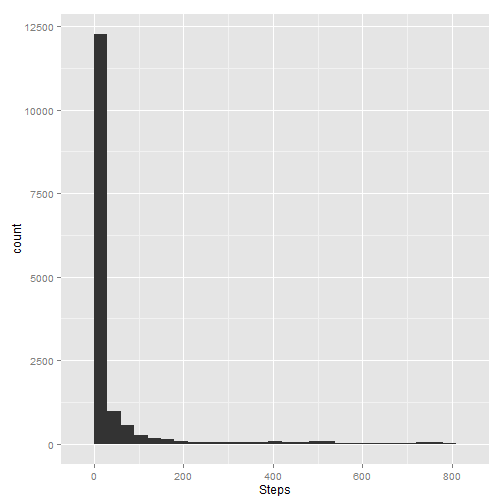
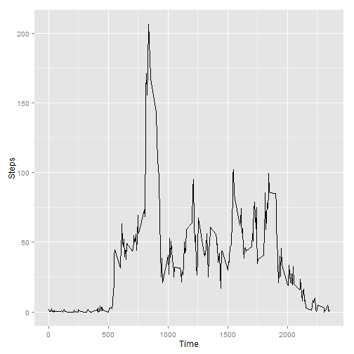
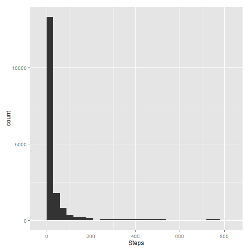
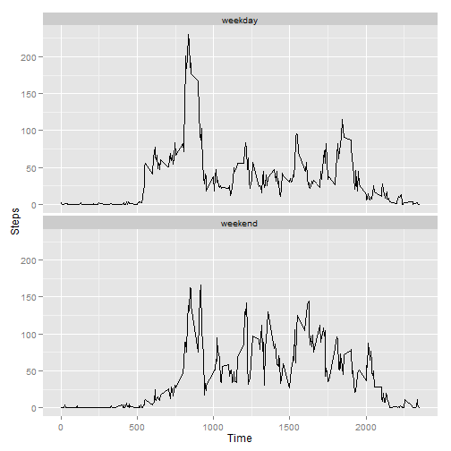

# Reproducible Research: Peer Assessment 1

## Loading and preprocessing the data

```r
suppressPackageStartupMessages(require(data.table))
data <- fread('activity.csv')
```

## Histogram of Steps

```r
suppressPackageStartupMessages(require(ggplot2))
ggplot(data) + geom_histogram(aes(steps), binwidth=30) + labs(x='Steps')
```

 

## What are the mean and median number of steps taken per day?

```r
mean(data$steps, na.rm=T)
```

```
## [1] 37.38
```

```r
median(data$steps, na.rm=T)
```

```
## [1] 0
```

## What is the average daily activity pattern?

```r
suppressPackageStartupMessages(require(dplyr))
time <- data %>% group_by(interval) %>% summarise(steps=mean(steps, na.rm=T))
ggplot(time, aes(interval, steps)) + geom_line() + labs(x='Time', y='Steps')
```

 

```r
highest <- time[which.max(steps),]$interval
```
Time interval 835 has the most steps

## Imputing missing values

```r
num_missing <- sum(is.na(data))
```
There are 2304 missing values

### Imputing missing values with the average value of steps for that day

```r
imputed_data <- copy(data)
impute_step <- Vectorize(function(inter, steps) {
	if(is.na(steps)) {
		return(mean(data[interval == inter,]$steps, na.rm=T))
	} else {
		return(steps)
	}
})
imputed_data[,steps:=impute_step(interval, steps)]
```

```
##          steps       date interval
##     1: 1.71698 2012-10-01        0
##     2: 0.33962 2012-10-01        5
##     3: 0.13208 2012-10-01       10
##     4: 0.15094 2012-10-01       15
##     5: 0.07547 2012-10-01       20
##    ---                            
## 17564: 4.69811 2012-11-30     2335
## 17565: 3.30189 2012-11-30     2340
## 17566: 0.64151 2012-11-30     2345
## 17567: 0.22642 2012-11-30     2350
## 17568: 1.07547 2012-11-30     2355
```

## Histogram of Imputed Steps

```r
ggplot(imputed_data) + geom_histogram(aes(steps), binwidth=30) + labs(x='Steps')
```

 

## Mean and median of imputed data

```r
mean(imputed_data$steps)
```

```
## [1] 37.38
```

```r
median(imputed_data$steps)
```

```
## [1] 0
```
These values are the same as before NA values were filled in.

However, the number of steps has increased by 4.9026 per day

## Are there differences in activity patterns between weekdays and weekends?

```r
suppressPackageStartupMessages(require(lubridate))
imputed_data[,date:=ymd(date)]
```

```
##          steps       date interval
##     1: 1.71698 2012-10-01        0
##     2: 0.33962 2012-10-01        5
##     3: 0.13208 2012-10-01       10
##     4: 0.15094 2012-10-01       15
##     5: 0.07547 2012-10-01       20
##    ---                            
## 17564: 4.69811 2012-11-30     2335
## 17565: 3.30189 2012-11-30     2340
## 17566: 0.64151 2012-11-30     2345
## 17567: 0.22642 2012-11-30     2350
## 17568: 1.07547 2012-11-30     2355
```

```r
imputed_data[,weekend:=as.factor(ifelse(
		weekdays(date) == 'Sunday' | weekdays(date) == 'Saturday',
		'weekend',
		'weekday'
	))]
```

```
##          steps       date interval weekend
##     1: 1.71698 2012-10-01        0 weekday
##     2: 0.33962 2012-10-01        5 weekday
##     3: 0.13208 2012-10-01       10 weekday
##     4: 0.15094 2012-10-01       15 weekday
##     5: 0.07547 2012-10-01       20 weekday
##    ---                                    
## 17564: 4.69811 2012-11-30     2335 weekday
## 17565: 3.30189 2012-11-30     2340 weekday
## 17566: 0.64151 2012-11-30     2345 weekday
## 17567: 0.22642 2012-11-30     2350 weekday
## 17568: 1.07547 2012-11-30     2355 weekday
```

```r
imputed_summary <- data.frame(imputed_data) %>% regroup(list('weekend', 'interval')) %>% summarise(steps=mean(steps))
ggplot(imputed_summary, aes(interval, steps)) + geom_line() + facet_wrap(~weekend, ncol=1) + labs(x='Time', y='Steps')
```

 

